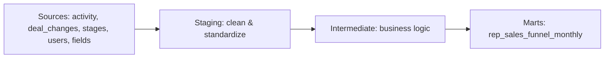

# CRM Sales Funnel Analytics (dbt)

A dbt data model for CRM sales funnel analytics, implementing a three-layer architecture (staging → intermediate → marts) for maintainability and reusability.

## Why this exists

Raw CRM export data (deals, activities, pipeline stages) isn't directly usable for reporting on rep performance or funnel health. This project transforms that data into a clean, tested monthly funnel report that shows deal counts at every stage — from lead generation through renewal — so sales leadership can spot bottlenecks and track conversion.

## Architecture



## Tech stack

- `dbt-core`
- `dbt-postgres`
- PostgreSQL (via Docker)
- Python 3.x

## Data Layers

### Sources
Defined in `models/sources.yml` — 6 CRM tables:
- `activity` - CRM activities (calls, meetings)
- `activity_types` - Activity type definitions
- `deal_changes` - Deal field change history
- `stages` - Pipeline stage definitions
- `users` - Sales representatives
- `fields` - Custom field definitions

### Staging Layer (`models/staging/`)
Clean and standardize source data with minimal transformations.

### Intermediate Layer (`models/intermediate/`)
Business logic transformations:
- `int_deal_stage_history` - Tracks when deals enter each pipeline stage
- `int_deal_activities` - Maps activities to funnel steps (Sales Calls)

### Mart Layer (`models/marts/`)
Business-facing models including the final report.

---

## Sales Funnel Report

**Model:** `rep_sales_funnel_monthly`

**Columns:** `month`, `kpi_name`, `funnel_step`, `deals_count`

### Funnel Steps (KPIs)

| Step | KPI Name | Data Source |
|------|----------|-------------|
| 1 | Lead Generation | Pipeline Stage |
| 2 | Qualified Lead | Pipeline Stage |
| 2.1 | Sales Call 1 | Activity (type='meeting') |
| 3 | Needs Assessment | Pipeline Stage |
| 3.1 | Sales Call 2 | Activity (type='sc_2') |
| 4 | Proposal/Quote Preparation | Pipeline Stage |
| 5 | Negotiation | Pipeline Stage |
| 6 | Closing | Pipeline Stage |
| 7 | Implementation/Onboarding | Pipeline Stage |
| 8 | Follow-up/Customer Success | Pipeline Stage |
| 9 | Renewal/Expansion | Pipeline Stage |

---

## Setup & Run

### 1) Start the database
```bash
docker compose up -d
```

### 2) Load sample data
```bash
docker exec crm-db-1 psql -U admin -d postgres -c "\COPY stages FROM '/raw_data/stages.csv' DELIMITER ',' CSV HEADER;"
docker exec crm-db-1 psql -U admin -d postgres -c "\COPY activity_types FROM '/raw_data/activity_types.csv' DELIMITER ',' CSV HEADER;"
docker exec crm-db-1 psql -U admin -d postgres -c "\COPY users FROM '/raw_data/users.csv' DELIMITER ',' CSV HEADER;"
docker exec crm-db-1 psql -U admin -d postgres -c "\COPY fields FROM '/raw_data/fields.csv' DELIMITER ',' CSV HEADER;"
docker exec crm-db-1 psql -U admin -d postgres -c "\COPY activity FROM '/raw_data/activity.csv' DELIMITER ',' CSV HEADER;"
docker exec crm-db-1 psql -U admin -d postgres -c "\COPY deal_changes FROM '/raw_data/deal_changes.csv' DELIMITER ',' CSV HEADER;"
```

### 3) Configure your dbt profile
Copy the example profile and adjust if needed:
```bash
cp profiles.yml.example profiles.yml
```

### 4) Run dbt
```bash
pip install dbt-postgres
dbt debug
dbt run
dbt test
```

---

## Notes

- Sample/synthetic data only — no real customer data is included in this repo.
- Do not commit `profiles.yml` or dbt build artifacts (`target/`, `dbt_packages/`, `logs/`) — see `.gitignore`.

## Author

**Prakriti Jain** — prakriti.ps.jain@gmail.com